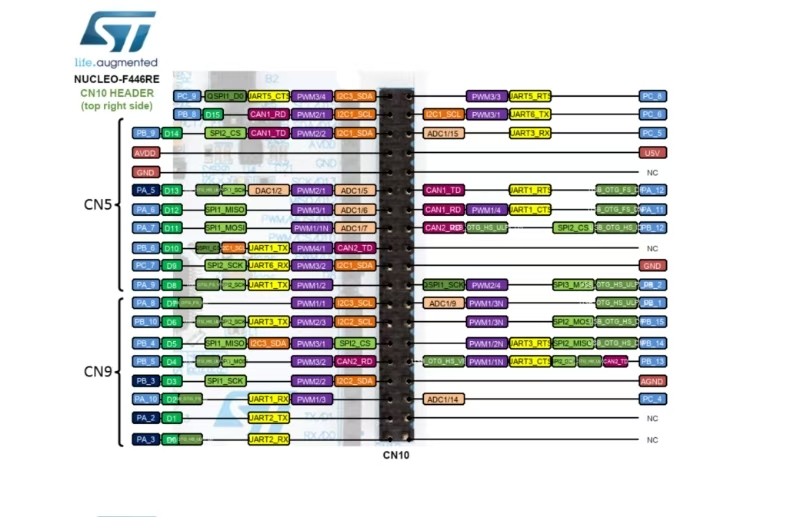
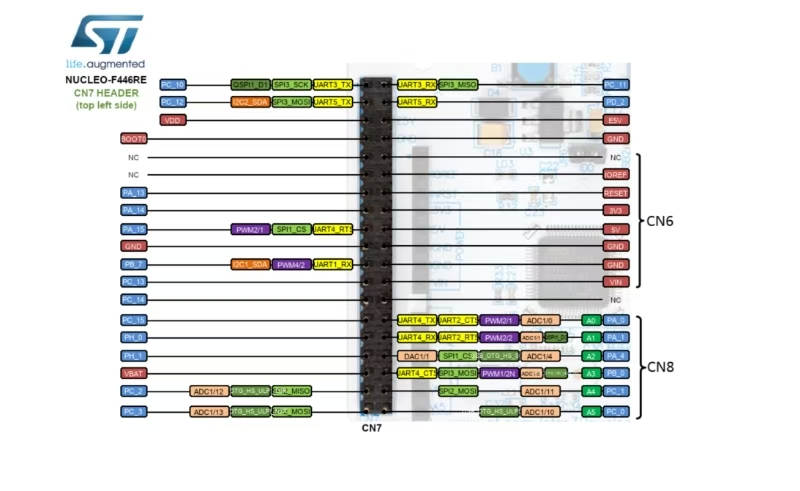

# MazeBot 引脚连接清单

MCU: STM32F446RET6 (Nucleo-F446RE)
时钟: HSE BYPASS 8MHz → PLL 180MHz, APB1=45MHz, APB2=90MHz

## 说明

当前 `DnB/MazeBot` 已接入以下 UI 相关功能：
- OLED SSD1306 驱动（PB8/PB9, I2C1）
- 4 个按钮输入：E-STOP / START / RETURN / MODE（PC13 / PB4 / PB7 / PB2）
- 3 路电位器输入（PA4 / PA5 / PA6）

四个按钮的软件功能定义如下：
- E-STOP：触发急停锁存，立即禁止运动输出
- START：切换到 `ROBOT_EXPLORING`
- RETURN：切换到 `ROBOT_RETURNING`
- MODE：在当前实现中用于 `ROBOT_IDLE <-> ROBOT_EXPLORING` 切换；急停状态下与 START 组合用于复位

## 电机驱动板

| 功能 | 引脚名称 | STM32引脚号 | 说明/备注 |
| ---- | -------- | ----------- | -------- |
| 左轮电机 AIN1 | `AIN1` | `PC8` | 左轮方向控制 |
| 左轮电机 AIN2(PWM) | `AIN2_PWM` | `PB10` | 左轮 PWM 调速 |
| 右轮电机 BIN1 | `BIN1` | `PC7` | 右轮方向控制 |
| 右轮电机 BIN2(PWM) | `BIN2_PWM` | `PB3` | 右轮 PWM 调速 |
| 左轮编码器 E1A | `LEFT_ENC_A` | `PC6` | 左编码器 A 相 |
| 左轮编码器 E1B | `LEFT_ENC_B` | `PB5` | 左编码器 B 相 |
| 右轮编码器 E2A | `RIGHT_ENC_A` | `PA8` | 右编码器 A 相 |
| 右轮编码器 E2B | `RIGHT_ENC_B` | `PA9` | 右编码器 B 相 |

## UART

TX/RX 均为 MCU 侧引脚定义（MCU TX → 外设 RX，MCU RX → 外设 TX）

| 功能           | 外设     | TX(MCU) | RX(MCU) | 波特率    | DMA RX       | 备注          |
| ------------ | ------ | ------- | ------- | ------ | ------------ | ----------- |
| IMU IM900    | USART1 | PB6     | PA10    | 115200 | DMA2_Stream2 | IDLE中断      |
| Debug/printf | USART2 | PA2     | PA3     | 115200 | DMA1_Stream5 | ST-Link VCP |
| 蓝牙 HC-04     | UART4  | PA0     | PA1     | 921600 | DMA1_Stream2 | IDLE中断      |
| RPLIDAR C1   | UART5  | PC12    | PD2     | 460800 | DMA1_Stream0 | IDLE中断      |

## 电机 (AT8236驱动)

| 功能      | 引脚   | 外设/模式       | 备注                      |
| ------- | ---- | ----------- | ----------------------- |
| 右电机 PWM | PB3  | TIM2_CH2    | PSC=349, ARR=255, ~1kHz |
| 左电机 PWM | PB10 | TIM2_CH3    | 同上                      |
| 右电机方向   | PC7  | GPIO OUT PP | MOTOR_R_DIR_Pin         |
| 左电机方向   | PC8  | GPIO OUT PP | MOTOR_L_DIR_Pin         |

## 编码器

| 功能   | CH1 | CH2 | 外设                | 备注                  |
| ---- | --- | --- | ----------------- | ------------------- |
| 右编码器 | PA8 | PA9 | TIM1 Encoder TI12 | ARR=65535, Filter=5 |
| 左编码器 | PC6 | PB5 | TIM3 Encoder TI12 | ARR=65535, Filter=5 |

## 系统

| 引脚   | 功能             | 备注       |
| ---- | -------------- | -------- |
| PA13 | SYS_JTMS-SWDIO | SWD 调试   |
| PA14 | SYS_JTCK-SWCLK | SWD 调试   |
| PH0  | RCC_OSC_IN     | HSE 8MHz |
| PH1  | RCC_OSC_OUT    | HSE      |

## OLED 显示 (SSD1306)

| 功能       | 引脚  | 外设/模式        | 备注               |
| -------- | --- | ------------ | ---------------- |
| OLED SCL | PB8 | I2C1_SCL AF4 | 400kHz Fast Mode |
| OLED SDA | PB9 | I2C1_SDA AF4 | 开漏 + 上拉          |

## 按钮

| 按钮功能   | 引脚   | 外设/模式         | 软件行为说明 |
| -------- | ---- | ------------- | ------------ |
| E-STOP   | PC13 | EXTI13 下降沿    | 急停输入，触发后锁存 `ROBOT_ESTOP`，禁止运动输出 |
| START    | PB4  | GPIO Input 上拉 | 20ms 轮询消抖；按下后切换到 `ROBOT_EXPLORING` |
| RETURN   | PB7  | GPIO Input 上拉 | 20ms 轮询消抖；按下后切换到 `ROBOT_RETURNING` |
| MODE     | PB2  | GPIO Input 上拉 | 20ms 轮询消抖；普通状态下切换 `ROBOT_IDLE/ROBOT_EXPLORING`，急停时与 START 组合复位 |

## 电位器 (ADC)

| 功能              | 引脚  | 外设/模式    | 备注                      |
| --------------- | --- | -------- | ----------------------- |
| POT1 (Kp)       | PA4 | ADC1_IN4 | DMA2_Stream0, EMA α=0.1 |
| POT2 (Base Spd) | PA5 | ADC1_IN5 | 映射 20~80                |
| POT3 (Turn Spd) | PA6 | ADC1_IN6 | 映射 15~50                |
