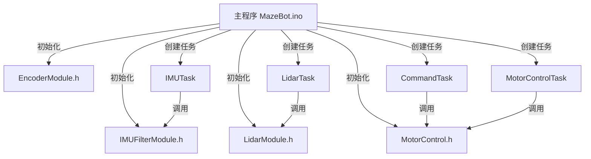

# 2025年 Design and Build 实践日志及说明文档

### 第 17 组下位机任务成员及分工（Telcom+EIE）

| 小组成员/贡献度    | 班级       | 学号       | 分工                                                         |
| ------------------ | ---------- | ---------- | ------------------------------------------------------------ |
| 陈一凡（组长）/20% | 2023215103 | 2023213098 | 统筹进度、设计接线方案、连接及检查硬件问题、设计FreeRTOS任务及各传感器调试程序、查阅硬件手册及功能说明、撰写文档 |
| 王子璇/15%         | 2023215101 | 2023213051 | 辅助进度管理、撰写文档、搜集整合代码及硬件手册等资料、辅助功能测试及装车 |
| 魏澄/20%           | 2023215105 | 2023213171 | 核查程序逻辑、检查硬件电路、设计及调试运动控制逻辑、设计IMU和雷达数据采集、解算和滤波功能、记录串口调试数据 |
| 杨梦迪/15%         | 2023215107 | 2023213226 | 搜集整合代码及硬件手册等资料、搜集整合关键硬件驱动库函数并指导组员使用、辅助撰写文档、车辆美化 |
| 李聪博/15%         | 2023215109 | 2023213269 | 检查、测试及维修硬件电路、车辆组装与维修、辅助手册及信息查阅、辅助测试运动功能和调参、辅助撰写文档 |
| 张云骜/15%         | 2023215117 | 2023213519 | 车辆组装与维修、核查程序逻辑、检查硬件电路、辅助测试运动功能和调参、辅助撰写文档 |

## 一、项目任务

| 项目说明 | 本项目旨在设计与建造一款配备 2D 激光雷达系统的自主移动机器人，其核心目标是实现智能迷宫导航与实时环境建图。该机器人在结构化迷宫环境中运行而开发，能够自主探索迷宫、精准识别并定位出口，随后无需人工干预即可返回初始起点。 |
| ------------ | ------------------------------------------------------------ |
| 硬件功能 | **基础功能**<br/>1. 传感器（IMU，雷达，编码器等）数据采集后通过蓝牙回传至上位机。<br/>2. 通过蓝牙接收上位机控制信号并快速响应和执行各项运动功能（前进、后退、左转、右转及刹车）。<br/>3. 所有功能模块编写配套的测试模块，辅助快速发现硬件问题和参数调试。<br/><br/>**进阶功能**<br/>1. 通过EWA滤波辅助IMU进行姿态解算和PID控制。<br/>2. 通过FreeRTOS 实时调度以上所有任务，实现多线程操作和并发处理。<br/>3. 设计“蓝牙/串口”实时调参模块，辅助模块功能快速实现。 |

## 二、工作日志

| 姓名   | 6月30日                                                      | 7月1日                                                       | 7月2日                                                       |
| ------ | ------------------------------------------------------------ | ------------------------------------------------------------ | ------------------------------------------------------------ |
| 陈一凡 | 查找并学习了与2D激光雷达系统、STM32F446RE微控制器、SLAMTEC RPLIDAR C1、MPU6500 IMU、AT8236电机驱动器等相关硬件组件的资料，了解其工作原理和使用方法。 | 梳理实验核心硬件（2D 激光雷达、STM32F446RE、MPU6500、AT8236 等）技术文档，整理各组件工作原理、通信协议，带领组员编写电机控制代码以及开发蓝牙通信功能 | 参与 PID 优化测试，结合实际场景（小车启动、转向）给出参数调整建议，推动控制精度提升。  同步 IMU 开发进度，协助解决传感器校准、数据解析难题，规划与电机控制、雷达模块的融合方案。 |
| 王子璇 | 下载并安装了Arduino IDE，在Arduino框架中集成FreeRTOS。       | 开始开发蓝牙通信功能，利用HC-04蓝牙模块实现了机器人与主机PC之间的无线通信。 | 同参与编写代码，实现了MPU6500 IMU的数据读取功能，计算出机器人的姿态信息，包括俯仰角、横滚角和偏航角 ，获取了加速度计和陀螺仪的原始数据。 |
| 魏澄   | 学习了Arduino框架、FreeRTOS、BreezySLAM、PythonRobotics等软件工具和库 | 编写了电机控制代码，通过AT8236电机驱动器实现了对520齿轮编码器直流电机的速度和方向控制。 | 编写代码，实现了MPU6500 IMU的数据读取功能，计算出机器人的姿态信息，包括俯仰角、横滚角和偏航角 ，获取了加速度计和陀螺仪的原始数据。 |
| 杨梦迪 | 安装了与2D激光雷达、IMU等硬件相关的库，如RPLidar SDK、MPU6500的Arduino库等，以便能够方便地读取和处理硬件数据。 | 参与开发蓝牙通信功能，利用HC-04蓝牙模块实现了机器人与主机PC之间的无线通信 | 同参与编写代码，实现了MPU6500 IMU的数据读取功能，计算出机器人的姿态信息，包括俯仰角、横滚角和偏航角 ，获取了加速度计和陀螺仪的原始数据。 |
| 李聪博 | 搭建小车的硬件框架，包括安装STM32F446RE微控制器、AT8236电机驱动器、520齿轮编码器直流电机、SLAMTEC RPLIDAR C1激光雷达、MPU6500 IMU等硬件组件。 | 参与编写了电机控制代码，测试方向切换流畅性 ，测试电机功能以及编码器功能。 | 参与调试PWM占空比， 降低转速波动，使小车能够在地面平稳跑动。测试小车直线行驶，使小车能够在地面平稳跑动。 |
| 张云骜 | 参与搭建小车，保证各个硬件之间的连接正确无误，如电机驱动器与电机的连接、雷达与微控制器的通信接口连接等 | 参与编写了电机控制代码，测试方向切换流畅性 ，测试电机功能以及编码器功能。 | 调试PWM占空比，                                                降低转速波动，使小车能够在地面平稳跑动。测试小车直线行驶，使小车能够在地面平稳跑动。 |

*（续表）*

| 姓名   | **7月3日**                                                   | **7月4日** |
| ------ | ------------------------------------------------------------ | ---------- |
| 陈一凡 | 统筹优化任务，明确小车性能指标分配给对应组员。  牵头 PPT 框架设计，梳理 “硬件开发 - 算法实现 - 功能验证” 主线，同步收集各模块成果素材（如 IMU 校准曲线、蓝牙通信测试报告 ）。  初审小学期报告大纲，明确结构，要求各成员补充对应模块技术细节（如 IMU 融合公式 ）。 | 实验验收   |
| 王子璇 | 制作PPT “通信模块” ，设计交互示意图（展示指令流、数据流走向），撰写小学期报告 “蓝牙通信模块” 章节，详述开发流程、技术难点及解决效果。 | 实验验收   |
| 魏澄   | 制作 PPT “电机控制模块”，编写算法原理简化说明，撰写小学期报告 “电机控制模块”，核对报告中电机控制参数，确保与最新测试数据一致。 | 实验验收   |
| 杨梦迪 | 参与 PPT “通信模块” 制作，设计交互示意图（展示指令流、数据流走向 ），撰写小学期报告 “蓝牙通信模块” 章节，详述开发流程、技术难点及解决效果。 | 实验验收   |
| 李聪博 | 优化小车硬件结构，加固传感器支架（激光雷达、IMU ），减少运动振动干扰，制作 PPT “硬件设计模块”，拍摄硬件细节图（标注关键组件：STM32 开发板、电机驱动器、传感器布局 ），编写结构设计说明，撰写小学期报告 “硬件设计模块”，详述硬件选型依据（如 STM32F446RE 性能匹配度 ）、结构优化过程（从原型到稳定版的迭代 ）及测试结果。 | 实验验收   |
| 张云骜 | 优化小车硬件结构，加固传感器支架（激光雷达、IMU ），减少运动振动干扰，制作 PPT “硬件设计模块”，拍摄硬件细节图（标注关键组件：STM32 开发板、电机驱动器、传感器布局 ），编写结构设计说明，撰写小学期报告 “硬件设计模块”，详述硬件选型依据（如 STM32F446RE 性能匹配度 ）、结构优化过程（从原型到稳定版的迭代 ）及测试结果。 | 实验验收   |


# MazeBot 下位机说明文档

## 1. 硬件总览

MazeBot下位机由STM32主控板、电机驱动、编码器、IMU、雷达、蓝牙模块等组成。各模块通过标准接口与主控板连接，实现小车的运动控制、姿态感知、环境感知和无线通信。


图1. 使用的硬件设备

## 2. 引脚分配表

| 功能               | 引脚名称    | STM32引脚号      | 说明/备注                  |
| ------------------| ----------- | ---------------- | --------------------------|
| 左轮电机 AIN1      | AIN1        | PC8              | 方向控制                   |
| 左轮电机 AIN2(PWM) | AIN2_PWM    | PB10             | PWM调速                    |
| 右轮电机 BIN1      | BIN1        | PC7              | 方向控制                   |
| 右轮电机 BIN2(PWM) | BIN2_PWM    | PB3              | PWM调速                    |
| 左轮编码器 E1A     | LEFT_ENC_A  | PC6              | 编码器A相                  |
| 左轮编码器 E1B     | LEFT_ENC_B  | PB5              | 编码器B相                  |
| 右轮编码器 E2A     | RIGHT_ENC_A | PA8              | 编码器A相                  |
| 右轮编码器 E2B     | RIGHT_ENC_B | PA9              | 编码器B相                  |
| IMU6050电源       | VCC         | 3.3V             |                            |
| IMU6050地线       | GND         | GND              |                            |
| IMU6050 I2C       | SCL         | PB8              | I2C时钟线                  |
| IMU6050 I2C       | SDA         | PB9              | I2C数据线                  |
| IMU900电源        | VCC         | 5V                |                           |
| IMU900地线        | GND         | GND               |                           |
| IMU900 TX         | TX          | PA10              | UART_1 RX                 |
| IMU900 RX         | RX          | PB6               | UART_1 TX                 |
| 雷达电源           | VCC         | 5V               |                            |
| 雷达地线           | GND         | GND              |                            |
| 雷达串口TX         | TX          | PD2              | UART_5 RX                  |
| 雷达串口RX         | RX          | PC12             | UART_5 TX                  |
| 蓝牙电源           | VCC         | 5V               |                            |
| 蓝牙地线           | GND         | GND              |                            |
| 蓝牙串口RX         | RX          | PA0              | UART_4 TX                  |
| 蓝牙串口TX         | TX          | PA1              | UART_4 RX                  |

---

## 3. 硬件结构示意图（左侧 Firmware 部分）


图2. 软硬件综合架构

---

## 4. 硬件模块功能及代码说明

| 模块       | 功能描述                                               | 运作逻辑（结合代码）                                         |
| ---------- | ------------------------------------------------------ | ------------------------------------------------------------ |
| 电机驱动   | 控制小车前进、后退、转向、停止等运动                   | - `MotorControl.h` 中 `setMotor()` 设置左右轮PWM和方向<br>- 蓝牙指令经 `processBluetoothCommand()` 处理后，记录当前命令<br>- `MotorControlTask` 每100ms调用 `updateMotorControlWithoutPID()`，持续输出PWM信号<br>- 500ms内无新指令自动停止电机，防止失控 |
| 编码器     | 检测轮子转动脉冲数，实现测速和里程计                   | - `EncoderModule.h` 通过PC6/PB5（左轮）、PA8/PA9（右轮）接收编码器信号<br>- `leftEncoderISR()`、`rightEncoderISR()`中断服务函数更新计数<br>- `getLeftTicks()`、`getRightTicks()`获取累计脉冲数，为速度和里程计算提供数据 |
| IMU模块    | 检测小车姿态（角度）、加速度和角速度，实现运动状态估算 | - `IMUFilterModule.h` 通过I2C与主控通信，`initIMU()`初始化和校准<br>- `IMUTask` 定时调用 `updateIMUWithFilter()` 进行滤波和零偏校正，实时更新姿态角和加速度<br>- 可用 `sendIMUData()` 通过蓝牙回传IMU数据 |
| 雷达模块   | 环境扫描与测距，提供障碍物信息                         | - `LidarModule.h` 串口通信，`initLidar()`初始化雷达<br>- `LidarTask` 定时调用 `readAndSendLidar()` 采集数据并通过蓝牙发送<br>- 数据格式清晰，便于上位机地图构建或避障 |
| 蓝牙模块   | 无线通信，接收上位机/手机指令，回传状态信息            | - `IMUFilterModule.h` 定义 `BTSerial` 作为蓝牙串口，波特率9600<br>- `CommandTask` 每20ms检查蓝牙串口，读取指令并调用 `processBluetoothCommand()`<br>- 蓝牙串口也用于回传IMU、雷达、里程计等状态信息 |
| 供电与地线 | 提供稳定电压，确保信号完整和系统可靠                   | - 各模块根据规格接3.3V或5V电源<br>- 所有模块GND与主控板共地，防止信号干扰或通信异常<br>- 正确供电和地线连接是系统稳定运行基础 |

表1. 硬件模块功能与运作逻辑


## 4.1 项目结构

```
MazeBot/
├── MazeBot.ino              // 主程序入口，任务调度与系统初始化
├── IMUFilterModule.h        // IMU初始化、滤波、蓝牙串口定义
├── LidarModule.h            // 雷达数据采集与蓝牙发送
├── MotorControl.h           // 电机控制、蓝牙指令处理、超时保护
├── EncoderModule.h          // 编码器计数与中断
├── MotorTestTask.h          // 电机测试任务
├── EncoderTestTask.h        // 编码器测试任务
├── 蓝牙控制说明.md          // 蓝牙控制协议与说明
└── DnB2025_Briefing_翻译... // 需求文档（非代码部分）
```

## 4.2 主要模块功能与代码逻辑

### 4.2.1 主程序（MazeBot.ino）

- **功能**：系统初始化、任务调度、主循环（FreeRTOS多任务）。
- **主要内容**：
  - 初始化各硬件模块（IMU、雷达、电机、编码器、蓝牙）。
  - 创建并启动各功能任务（IMU、雷达、里程计、蓝牙指令、运动控制等）。
  - 通过FreeRTOS实现多任务并发，主循环`loop()`为空。

- **主要任务说明**：
  - `IMUTask`：定时更新IMU数据。
  - `LidarTask`：定时读取并发送雷达数据。
  - `OdometryTask`：定时输出位姿估计。
  - `CommandTask`：定时检查蓝牙串口，接收并处理控制指令。
  - `MotorControlTask`：定时根据当前指令控制电机。

### 4.2.2 电机控制模块（MotorControl.h）

- **功能**：实现小车运动控制、蓝牙指令解析、超时保护。
- **主要内容**：
  - 电机引脚定义、PWM输出、方向控制。
  - `setMotor()`：设置左右轮PWM和方向。
  - `processBluetoothCommand(cmd)`：解析蓝牙指令，设置当前命令。
  - `updateMotorControlWithoutPID()`：根据当前命令持续输出PWM，超时自动刹车。
  - 超时保护机制，防止失控。

### 4.2.3 编码器模块（EncoderModule.h）

- **功能**：测速与里程计，实时记录轮子转动脉冲数。
- **主要内容**：
  - 编码器引脚定义。
  - 中断服务函数`leftEncoderISR()`、`rightEncoderISR()`，在信号变化时更新计数。
  - `initEncoders()`：初始化编码器及中断。
  - `getLeftTicks()`、`getRightTicks()`：获取当前累计脉冲数。

### 4.2.4 IMU模块（IMUFilterModule.h）

- **功能**：姿态检测、加速度与角速度测量、蓝牙串口定义。
- **主要内容**：
  - I2C初始化、IMU校准、滤波处理。
  - `initIMU()`：初始化IMU并校准零偏。
  - `updateIMUWithFilter()`：定时滤波、更新姿态角。
  - `sendIMUData()`：通过蓝牙回传IMU数据。
  - `HardwareSerial BTSerial(PA1, PA0)`：定义蓝牙串口。

### 4.2.5 雷达模块（LidarModule.h）

- **功能**：环境扫描与测距，数据通过蓝牙回传。
- **主要内容**：
  - 雷达初始化、数据采集、蓝牙/串口发送。
  - `initLidar()`：初始化雷达。
  - `readAndSendLidar()`：采集数据并通过蓝牙发送。

### 4.2.6 测试任务模块

- **MotorTestTask.h**：用于电机功能测试，自动循环前进、后退、转向、停止等动作。
- **EncoderTestTask.h**：用于编码器功能测试，定时输出左右轮脉冲计数。

### 4.2.7 蓝牙控制协议（详见“蓝牙控制说明.md”）

- **指令集**：

  | 指令 | 功能 | 说明               |
  | ---- | ---- | ------------------ |
  | w    | 前进 | 左右轮正转         |
  | s    | 后退 | 左右轮反转         |
  | a    | 左转 | 左轮反转，右轮正转 |
  | d    | 右转 | 左轮正转，右轮反转 |
  | x    | 停止 | 停止所有电机       |

- **控制逻辑**：
  - `CommandTask`每20ms检查蓝牙串口，收到指令后调用`processBluetoothCommand()`。
  - 指令会持续执行，直到收到新指令或超时（500ms）。
  - 超时自动刹车，防止失控。
  - 状态信息通过串口和蓝牙实时输出，便于调试。

## 4.3 关键函数与任务调用关系

| 任务/函数                        | 主要作用                                         | 相关文件          |
| -------------------------------- | ------------------------------------------------ | ----------------- |
| `setup()`                        | 系统初始化，创建任务，启动调度器                 | MazeBot.ino       |
| `CommandTask()`                  | 蓝牙指令接收与处理                               | MazeBot.ino       |
| `processBluetoothCommand()`      | 解析蓝牙指令，设置当前命令                       | MotorControl.h    |
| `MotorControlTask()`             | 定时调用`updateMotorControlWithoutPID()`控制电机 | MazeBot.ino       |
| `updateMotorControlWithoutPID()` | 按当前命令输出PWM，超时自动刹车                  | MotorControl.h    |
| `IMUTask()`                      | 定时更新IMU数据                                  | MazeBot.ino       |
| `updateIMUWithFilter()`          | IMU数据滤波与姿态角更新                          | IMUFilterModule.h |
| `LidarTask()`                    | 定时读取并发送雷达数据                           | MazeBot.ino       |
| `readAndSendLidar()`             | 采集雷达数据并通过蓝牙发送                       | LidarModule.h     |
| `EncoderTestTask()`              | 输出编码器计数，测试用                           | EncoderTestTask.h |
| `MotorTestTask()`                | 自动测试电机动作，测试用                         | MotorTestTask.h   |

---

## 4.4 典型使用流程

1. **硬件连接**：按引脚分配表连接各模块，确保供电和地线共地。
2. **上电启动**：主控板上电，串口输出初始化信息。
3. **蓝牙配对**：用手机/电脑蓝牙助手连接，波特率9600。
4. **发送指令**：发送'w'前进，'a'左转，'x'停止等，指令持续500ms或被新指令覆盖。
5. **状态监控**：通过串口/蓝牙实时查看小车状态、IMU、雷达、编码器等信息。
6. **调试与扩展**：可单独运行测试任务，或扩展新功能模块。

## 4.5 调试与扩展建议

- **分模块调试**：建议先用`MotorTestTask`、`EncoderTestTask`等单独测试各硬件功能。
- **串口监控**：充分利用串口输出的调试信息，快速定位问题。
- **蓝牙通信**：确保波特率一致，RX/TX接线正确。
- **代码扩展**：可在FreeRTOS任务框架下，添加更多传感器或控制逻辑。
- **安全保护**：如需更高安全性，可增加看门狗、掉线检测等机制。

## 4.6 代码结构与调用关系示意图



---

## 5. 编写程序时遇到的问题及解决方案

| 问题现象                     | 可能原因                                         | 解决方案                                                     |
| :--------------------------- | :----------------------------------------------- | :----------------------------------------------------------- |
| 蓝牙串口收不到数  据         | RX/TX接反，波特率设置不一致，蓝牙模块未配对成功  | 检查蓝牙模块RX/TX与主控板的TX/RX是否正确对接，确认波特率均为9600，重新配对蓝牙模块 |
| 蓝牙指令偶尔丢失或延迟       | 蓝牙信号干扰，串口缓存溢出，任务优先级设置不合理 | 尽量远离强干扰源，优化FreeRTOS任务优先级，增加串口缓存区，缩短指令处理周期 |
| 电机无法转动或只转一侧       | 电机驱动板供电不足，PWM信号未输出，驱动板损坏    | 检查电机驱动VCC和GND，确认PWM引脚有信号输出，尝试更换驱动板  |
| 电机转动方向与预期相反       | 电机接线顺序与代码方向定义不一致                 | 交换电机正负极或调整代码中方向参数                           |
| 编码器计数不变或乱跳         | 编码器信号线接触不良，未正确配置中断，干扰严重   | 检查编码器A/B信号线连接，确认中断已使能，必要时加屏蔽线或滤波电容 |
| 编码器计数方向与实际不符     | A/B信号线接反                                    | 交换A/B信号线或调整中断服务函数的方向判断                    |
| IMU数据全为零或无响应        | I2C未初始化，SCL/SDA接反，IMU供电不足            | 检查I2C引脚连接，确认IMU供电为3.3V，使用示波器检测I2C信号    |
| IMU姿态角漂移严重            | 零偏未校准，滤波参数不合适                       | 启动时保持静止进行校准，调整滤波系数，定期重置零偏           |
| 雷达无数据或报错             | 雷达供电不足，串口接线错误，驱动库不兼容         | 检查雷达VCC为5V，TX/RX接线正确，使用官方推荐的驱动库         |
| 雷达数据杂乱或丢包           | 串口波特率设置不一致，数据处理不及时             | 确认主控与雷达波特率一致，提高数据处理任务优先级             |
| 小车运动时偶尔失控或自动刹车 | 蓝牙指令超时保护触发，信号丢失                   | 保证指令发送频率高于500ms，优化蓝牙通信环境                  |
| 串口输出乱码                 | 波特率设置不一致，串口助手编码格式错误           | 确认串口助手与代码波特率一致，选择UTF-8或ASCII编码           |
| FreeRTOS任务不运行或死机     | 任务栈空间不足，优先级冲突，内存泄漏             | 增大任务栈空间，合理分配优先级，检查内存分配和释放           |
| 程序下载后无反应             | 烧录失败，主控板未复位，boot引脚设置错误         | 重新烧录，按下复位键，检查boot0/boot1引脚设置                |
| 电机驱动板发热严重           | 电机堵转，驱动板过载                             | 检查电机是否卡死，降低PWM占空比，选用更大功率驱动板          |
| 蓝牙配对后无法通信           | 蓝牙模块进入AT模式或未退出                       | 断电重启蓝牙模块，确保其处于正常通信模式                     |

------

## 6. 连接硬件时遇到的问题及解决方案

| 问题现象                     | 可能原因                   | 解决方案                                               |
| :--------------------------- | :------------------------- | :----------------------------------------------------- |
| 所有模块都无法正常工作       | 地线未共地，供电不稳定     | 确保所有模块GND与主控板GND连接，使用稳定电源           |
| 某模块上电后烧毁             | 供电电压过高或极性接反     | 仔细核对模块电源规格和正负极，必要时加保护二极管       |
| 电机转动时IMU/编码器数据异常 | 电机干扰信号影响弱信号线   | 电机线与信号线分开布线，信号线加屏蔽，主控板加滤波电容 |
| 雷达或蓝牙模块偶尔掉线       | 供电电流不足，接插件松动   | 使用大电流电源，检查插头插座牢固性                     |
| 编码器信号线过长导致信号丢失 | 线缆阻抗大，干扰强         | 缩短信号线长度，使用屏蔽线，必要时加信号缓冲器         |
| I2C设备冲突或识别不到        | 多个I2C设备地址冲突        | 检查各I2C设备地址，必要时修改地址或分时访问            |
| 主控板烧录失败               | USB线损坏，驱动未安装      | 更换USB线，重新安装驱动，尝试不同的下载器              |
| 电机驱动板不兼容             | 不同型号驱动板引脚定义不同 | 查阅驱动板手册，按实际引脚定义连接                     |
| 蓝牙模块无法被发现           | 模块损坏或未进入配对模式   | 检查蓝牙模块指示灯状态，必要时恢复出厂设置             |

## 7. 未来工作计划

| 内容       | 具体计划                                                     | 目标与意义                                                   |
| :------------- | ------------------------------------------------------------ | ------------------------------------------------------------ |
| 功能完善 | - 实现PID双环控制（引入IMU姿态结算）<br>- 结合雷达数据开发自动避障与路径规划<br>- 联合上位机设计数据打包与解算协议 | 提升运动精度和稳定性，实现自主导航，增强环境感知与定位能力   |
| 性能优化   | - 优化FreeRTOS任务调度与资源分配<br>- 提升蓝牙通信可靠性<br>- 完善电源与抗干扰设计 | 提高系统实时性、稳定性和抗干扰能力，保障小车在复杂环境下可靠运行 |
| 系统扩展   | - 开发上位机监控与控制软件<br>- 支持更多传感器接入（如超声波传感器等）<br> | 丰富功能，简化使用                                           |
| 测试验证 | - 进行联调测试<br>- 优化使用体验                             | 验证上下位机系统协同能力，提升鲁棒性，持续优化交互和易用性   |
| 其他 | - 完善技术文档和用户手册<br>- 统一代码规范，增加注释和单元测试<br>- 计划开源部分内容 | 便于团队协作和后续开发                                       |

# 8. 感想与回顾

回顾整个Design and Build项目，作为第17组的下位机团队，我们经历了从零开始的构想、硬件搭建、程序开发、测试与调试等多个阶段，最终圆满地完成了预期的目标任务，也在此过程中收获了很多宝贵的经验。

我们小组承担了整个项目下位机的开发任务，包括数据采集、无线通信、电机控制、姿态解算以及实时任务调度等。通过小组六名成员的通力合作，我们圆满完成了基础与进阶功能，具体包括：

-   **硬件数据采集与通信**：我们顺利实现了激光雷达、IMU与电机编码器的数据采集，并通过HC-04蓝牙模块与上位机实现了稳定的无线通信。过程中克服了蓝牙模块配置和数据传输稳定性等问题，积累了丰富的串口通信调试经验。
-   **运动控制与调试**：我们完成了基于AT8236驱动器的电机运动控制代码开发，经过多轮细致的PID参数调优和PWM占空比调节，使小车能够实现流畅的直线运动和方向控制。在反复的现场调试中，不断优化了电机转速稳定性和运动精度，这个过程不仅让我们深入理解了电机驱动原理，也锻炼了我们解决实际工程问题的能力。
-   **IMU姿态解算与融合算法**：我们成功实现了MPU6500 IMU数据的采集与姿态解算功能，包括俯仰角、横滚角和偏航角的精准计算。结合编码器数据，我们在实际测试中逐步提高了IMU数据的稳定性与准确性，确保了小车能够稳定地进行运动控制。
-   **FreeRTOS多线程任务管理**：我们使用FreeRTOS实现了各功能模块的并发管理，通过多线程任务的合理分配和调度，有效提升了整个系统的实时性与稳定性，培养了团队对实时嵌入式系统开发的深入理解和实践能力。

在整个项目推进过程中，每一位组员都积极参与、协同配合，分工明确且高效，大家在沟通与协作中逐渐形成默契。组内通过共同学习技术资料、互相交流开发经验与问题解决方法，让每个人都收获了跨领域的技能与知识积累。

当然，我们也遇到了很多挑战，比如硬件通信干扰问题、IMU数据的噪声问题、电机控制的精度调整等。这些问题都在团队的共同努力下逐一得到解决。经历了这些困难，我们意识到实际工程中的问题远比理论中复杂得多，但只要保持耐心、细心地去逐步分析和解决，就一定能取得进展。

整体来看，这次项目不仅提高了我们的动手实践能力，更让我们深刻地理解了一个工程项目从无到有、从设想到落地的完整流程。未来我们也会将这次项目中积累的经验与教训应用到更多实际工程项目中，进一步完善自身能力，期待在未来的项目中取得更大的突破。

一次很棒的团队协作，感谢大家的付出，辛苦了！

***陈一凡撰写于2025年7月4日***
